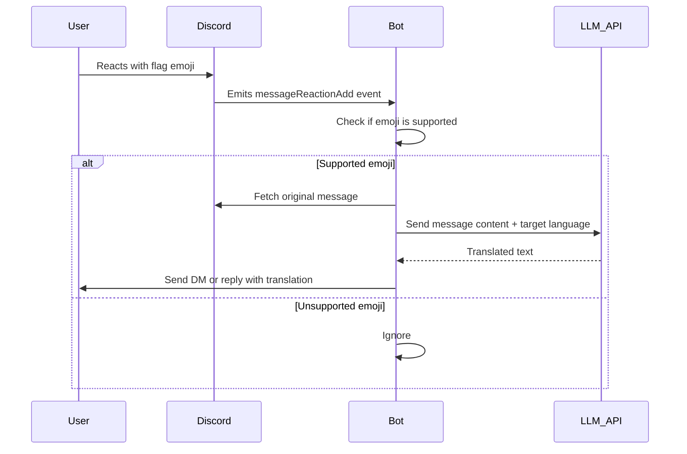

# Project Planning: Discord Translator Bot

---

## Vision & Goals

Build a high-quality, production-ready Discord bot that enables seamless multilingual communication across servers and channels, powered by LLMs, with a focus on modularity, testability, and excellent documentation.

---

## Architecture Overview

- **Language:** Node.js (TypeScript)
- **Core Components:**
  - Discord bot client
  - Channel bridging module
  - Translation service abstraction (supports multiple LLM providers)
  - Reaction-based translation handler
  - Configuration storage (SQLite initially, PostgreSQL planned)
  - Admin command interface
- **Design Principles:**
  - Modular, feature-based folder structure
  - Clear separation of concerns
  - Dependency injection where applicable
  - Environment-based configuration
  - Automated testing and CI/CD integration

---

## Tech Stack

- **Runtime:** Node.js (latest LTS)
- **Language:** TypeScript
- **Package Manager:** Yarn
- **Database:** SQLite (initial), PostgreSQL (future)
- **ORM:** Prisma or Knex.js (TBD)
- **LLM API:** OpenAI-compatible endpoints (local or cloud)
- **Testing:** Jest
- **Linting:** ESLint + Prettier
- **Documentation:** Markdown, Typedoc
- **Containerization:** Docker

---

## Constraints

- Avoid vendor lock-in for LLM providers.
- Keep secrets secure; do not expose API keys in code or prompts.
- Maintain compatibility with Discord API updates.
- Keep individual source files under 500 lines; refactor as needed.
- Prioritize clear, maintainable code with inline comments and docstrings.

---

## Development Guidelines

- Follow the task management workflow in `TASKS.md`.
- Write unit tests for every new feature or function.
- Update documentation continuously.
- Use environment variables for secrets and configuration.
- Containerize the app for deployment.
- Use MCP servers and AI assistants responsibly, following `.rooignore` exclusions.

---

## Reaction-Based Inline Translation Feature Plan

### Overview

Implement a feature where reacting to a message with a flag emoji triggers an inline translation of that message into the corresponding language. The translation will be sent as a DM or public reply (no ephemeral support).

### Implementation Steps

1. **Event Listener**
   - Create a new function `registerReactionListener(client: Client): void`.
   - Register a `messageReactionAdd` event listener:
     - Ignore reactions added by bots.
     - Ignore reactions not in guild text channels (optional).
     - Check if the emoji is a supported flag.

2. **Emoji to Language Mapping**
   - Create a utility object:
     ```typescript
     const emojiToLang: Record<string, string> = {
       '🇺🇸': 'en',
       '🇪🇸': 'es',
       '🇫🇷': 'fr',
       '🇩🇪': 'de',
       '🇨🇳': 'zh',
       '🇯🇵': 'ja',
       // Extend as needed
     };
     ```
   - If the emoji is not in the map, ignore the reaction.

3. **Fetch Original Message**
   - From the `messageReaction` object, fetch the original message if not cached.
   - Extract the message content.

4. **Call Translation Service**
   - Use `translationService.translate(message.content, targetLang)`:
     - `targetLang` is from the emoji mapping.
   - Handle errors gracefully:
     - If translation fails, notify the user with an error message.

5. **Send Translated Message**
   - Send the translation as:
     - A DM to the user who reacted, or
     - A public reply in the channel (configurable or default to one).
   - Include context, e.g.:
     ```
     🇪🇸 Translation:
     <translated text>
     ```

6. **Error Handling**
   - If the emoji is unsupported, do nothing.
   - If translation fails, notify the user politely.
   - Log errors for debugging.

7. **Integration**
   - Call `registerReactionListener(client)` in the bot startup (`index.ts`).
   - Keep the listener modular and well-documented.

8. **Documentation & Tests**
   - Document the new feature in code and relevant markdown files.
   - Add/update tests (if test framework is ready).
   - Update `TASKS.md` upon completion.

9. **Branching & Workflow**
   - Create a feature branch: `feat/reaction-translation`.
   - Push immediately after branch creation.
   - Get approval on this plan before coding.

### High-Level Flow (Mermaid Diagram)



---

## Future Considerations

- Web dashboard for configuration
- Multi-cloud LLM provider support
- Analytics and monitoring
- Localization of bot responses
- Advanced permission controls

---

---

## Future Ideas

- Multi-guild/server support with PostgreSQL backend
- Support for additional LLM providers
- Web dashboard for configuration and analytics
- Real-time translation streaming
- Voice translation capabilities
- Integration with other chat platforms (Slack, Teams)
- Advanced permission and role management
- Plugin system for custom translation workflows
- Automated language detection improvements
- AI-powered moderation tools
- Usage analytics and reporting dashboard
- Localization of bot responses
- Scheduled translation summaries or digests
