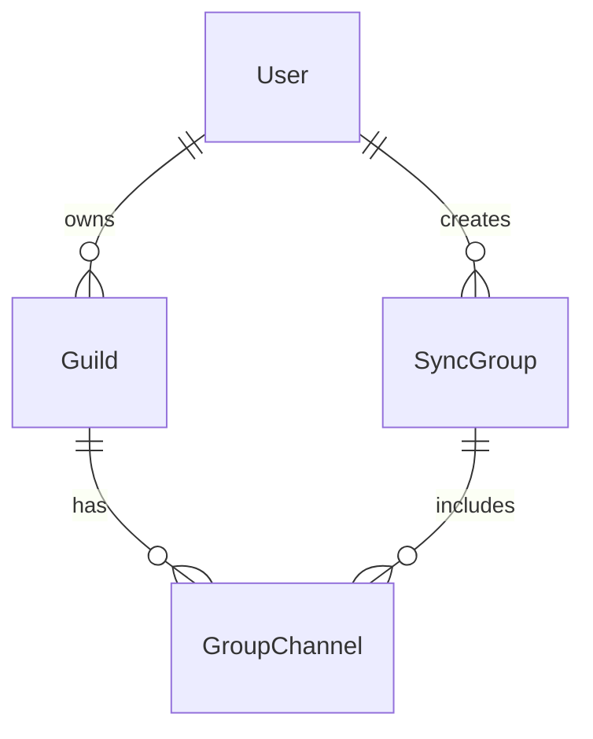

# GuildSync Architecture

## Overview

GuildSync bridges and optionally translates messages between multiple Discord channels across different servers. It supports flexible multi-channel groups, join codes, and admin approval workflows.

---

## Database Schema

### Guild

| Field        | Type                     | Description                        |
|--------------|--------------------------|------------------------------------|
| id           | bigint (Discord ID)      | Discord Guild ID (PK)              |
| name         | string                   | Guild/server name                  |
| icon         | string (hash or URL)     | Guild icon                         |
| created_at   | timestamp                | Record creation time               |
| updated_at   | timestamp                | Last update time                   |

---

### User

| Field        | Type                     | Description                        |
|--------------|--------------------------|------------------------------------|
| id           | bigint (Discord ID)      | Discord User ID (PK)               |
| username     | string                   | Username                           |
| avatar       | string (hash or URL)     | User avatar                        |
| created_at   | timestamp                | Record creation time               |
| updated_at   | timestamp                | Last update time                   |

---

### SyncGroup

| Field               | Type        | Description                          |
|---------------------|-------------|--------------------------------------|
| id                  | uuid        | Primary key                          |
| name                | string      | Group name                           |
| description         | string      | Optional description                 |
| join_code           | string, nullable | Code to join group, null disables joining |
| created_by_user_id  | bigint      | FK to User (Discord ID)              |
| created_at          | timestamp   | Creation time                        |
| updated_at          | timestamp   | Last update                          |

---

### GroupChannel

| Field               | Type        | Description                          |
|---------------------|-------------|--------------------------------------|
| id                  | uuid        | Primary key                          |
| discord_id          | bigint      | Discord Channel ID                   |
| guild_id            | bigint      | FK to Guild (Discord ID)             |
| sync_group_id       | uuid        | FK to SyncGroup                      |
| name                | string      | Channel name                         |
| rate_limit          | integer     | Slowmode seconds                     |
| language_code       | string      | Preferred language                   |
| status              | enum (pending, accepted, denied) | Join status         |
| added_by_user_id    | bigint      | FK to User (Discord ID)              |
| added_by_username   | string      | Username of adder                    |
| created_at          | timestamp   | Creation time                        |
| updated_at          | timestamp   | Last update                          |

---

## Entity Relationship Diagram

---

## Design Rationale

- **Unified IDs:** Use Discord snowflake IDs for Guilds and Users for consistency.
- **Join Codes:** Control access to SyncGroups; null disables joining.
- **Status Flags:** Manage pending/accepted/denied channel states without separate join request tables.
- **Minimal Metadata:** Track only essential Discord info plus sync-specific fields.
- **Compatibility:** Designed for both PostgreSQL and SQLite.
- **Extensibility:** Can add audit logs, permissions, or translation settings later.

---

## Future Considerations

- Enforce or relax one-channel-per-group constraints.
- Add audit logging for message relays.
- Support per-channel translation preferences.
- Implement usage metrics and billing support.
- Add role-based permissions within groups.